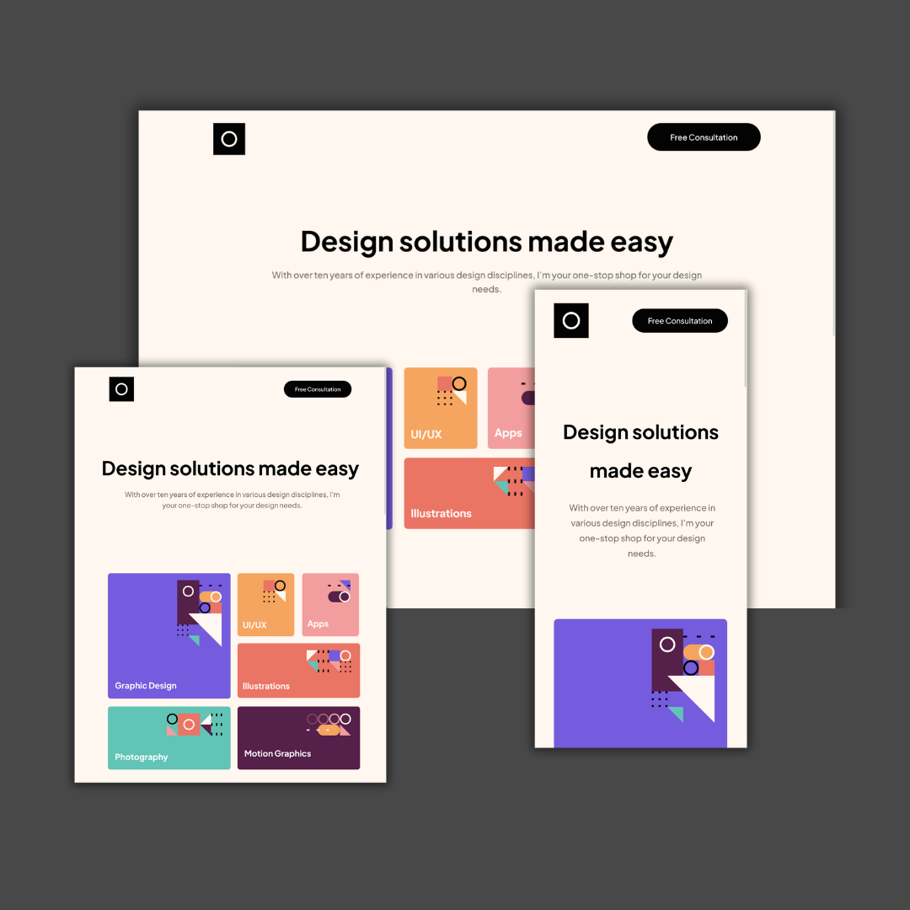

# Frontend Mentor - Single-page design portfolio

This is a solution to the [Single-page design portfolio](https://www.frontendmentor.io/challenges/singlepage-design-portfolio-2MMhyhfKVo/hub). 

Frontend Mentor challenges help to improve coding skills by building realistic projects. 

## Table of contents

- [Overview](#overview)
  - [The challenge](#the-challenge)
  - [Screenshot](#screenshot)
  - [Links](#links)
- [My process](#my-process)
  - [Built with](#built-with)
  - [What I learned](#what-i-learned)
  - [What can be improved](#What-can-be-improve)
- [Author](#author)

## Overview

### The challenge

Your challenge is to build out this single-page design portfolio site and get it looking as close to the design as possible.

You can use any tools you like to help you complete the challenge. So if you've got something you'd like to practice, feel free to give it a go.

Your users should be able to:

- View the optimal layout for the site depending on their device's screen size
- See hover states for all interactive elements on the page
- Navigate the slider using either their mouse/trackpad or keyboard

### Screenshot

### Links

- Solution URL: [GitHub](https://github.com/jaedevgithub/singlePageWebsitePortfolio)

- Live Site URL: [Github Pages](https://jaedevgithub.github.io/singlePageWebsitePortfolio/)

## My process

### Built with

- Semantic HTML5 markup.
- Flexbox.
- CSS Grid.
- Vanilla JavaScript.

### What I learned

- The skill list grid was a great challenge for the CSS grid.
- I use ChatGPT to create the JavaScript code with my HTML and CSS configuration.

### What can be improve

- Some CSS elements can be redundant.
- The slider only works when buttons are clicked.

## Author

- Frontend Mentor - [@jaegit123](https://www.frontendmentor.io/profile/jaegit123)
